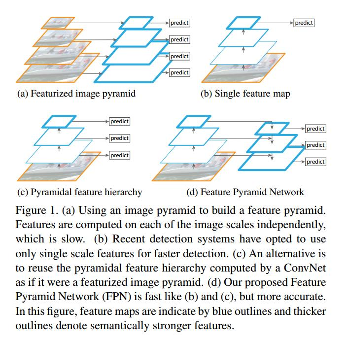
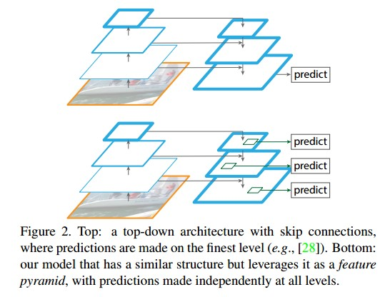
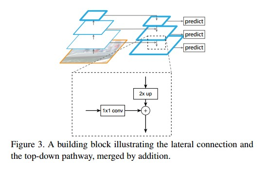

Feature Pyramid Networks for Object Detection论文阅读

# 摘要

特征金字塔**Feature pyramids**是用于检测不同尺度的对象的识别系统中的基本组件。 但是最近的深度学习对象检测器已经避免了金字塔表示，部分原因是它们是计算和内存密集型**compute and memory intensive**的。 在本文中，我们利用深层卷积网络固有的多尺度金字塔层次结构来构造具有边际额外成本**marginal extra cost**的特征金字塔。 开发了具有横向连接的自上而下架构，用于在所有尺度上构建高级语义特征图。 这种称为特征金字塔网络**Feature Pyramid Network**（FPN）的体系结构在几个应用程序中作为通用特征提取器显示出显着的改进。

# 介绍
Recognizing objects at vastly different scales is a fundamental challenge in computer vision.

The principle advantage of featurizing each level of an image pyramid is that it produces a multi-scale feature representation in which all levels are semantically strong, including the high-resolution levels.
对图像金字塔的每个级别进行特征化的主要优点是它产生了多尺度特征表示，其中所有级别在语义上都很强，包括高分辨率级别。

featurizing each level有局限性：推理时间**Inference time**大幅增加，不具有实用价值，此外，在图像金字塔上端到端地训练深度网络在内存方面是不可行的，因此，如果被利用，图像金字塔仅在测试时使用，这会产生训练/测试时间推断不一致。Fast/Faster RCNN默认不开启。

图像金字塔不是计算多尺度特征表示的唯一方法。深层ConvNet逐层计算特征层次结构，对于子采样层，特征层次结构具有固有的多尺度，金字塔形状。这种网内特征层次结构产生不同空间分辨率的特征图，但引入了由不同深度引起的大的语义间隙。 高分辨率地图具有低级别的特征，这些特征会损害其对象识别的表征能力。

单次检测器（SSD）是使用ConvNet的金字塔特征层次结构的第一次尝试之一，就好像它是一个特征化的图像金字塔（图1（c））。 理想情况下，SSD式金字塔将重复使用前向传递中计算的不同层的多尺度特征图，从而免费。 但为了避免使用低级功能，SSD放弃重新使用已经计算的层，而是从网络中的高位开始构建金字塔（例如，VGG网络的conv4-3），然后再添加几个新层。 因此，它错过了重用特征层次结构的更高分辨率地图的机会。 我们证明这些对于检测小物体很重要。

本文的目的是自然地利用ConvNet特征层次结构的金字塔形状，同时创建一个在所有尺度上都具有强大语义的特征金字塔。 为了实现这一目标，我们依靠一种架构，该架构将低分辨率，语义强大的特征与高分辨率，语义上较弱的特征相结合，通过自上而下的路径和横向连接(图1(d))。

采用自上而下和跳过连接的类似架构在最近的研究中很受欢迎[28,17,8,26]。 他们的目标是制作一个精确分辨率的高级特征图，并在其上进行预测（图2上图）。 相反，我们的方法利用该体系结构作为特征金字塔，其中预测（例如，对象检测）在每个级别上独立地进行（图2底部）。我们的模型回应了一个特色图像金字塔，它具有在这些作品中没有被探索过。

# Related Work
# FPN

我们的目标是利用ConvNet的金字塔特征层次结构，该层次结构具有从低级到高级的语义，并构建一个具有高级语义的特征金字塔。 由此产生的特征金字塔网络是通用的，在本文中我们主要关注滑动窗口提议器(Region Proposal Network，简称RPN)和基于区域的探测器(Fast R-CNN)。 我们还将FPN概括为Sec6中的实例分割。

## bottom-up pathway （左边部分）

通常有许多层生成相同大小的输出映射，我们说这些层处于同一网络阶段。 对于我们的特征金字塔，我们为每个阶段定义一个金字塔等级。 我们选择每个阶段的最后一层的输出作为我们的参考特征映射集，我们将丰富它们以创建我们的金字塔。 这种选择很自然，因为每个阶段的最深层应该具有最强的特征

## Top-down pathway and lateral connections. （右边部分）

较高的level：粗略但是能够映射出更高的分别率特征

自上而下的路径通过从较高的金字塔等级上升空间粗略但在语义上更强的特征映射来幻化更高分辨率的特征。 然后通过横向连接从自下而上的路径增强这些特征。 每个横向连接合并来自自下而上路径和自上而下路径的相同空间大小的特征图。 自下而上的特征映射具有较低级别的语义，但是它的激活更准确地进行了本地化，因为它被子采样次数较少。

图3显示了构建我们自上而下特征映射的构建块。 使用较粗糙的分辨率特征图，我们将空间分辨率上采样2倍（为简单起见，使用最近邻居上采样）。 然后通过逐元素加法将上行映射与相应的自下而上映射（其经历1×1卷积层以减少信道维度）合并。 迭代此过程，直到生成最精细的分辨率图。 为了开始迭代，我们简单地在C5上附加1×1卷积层以产生最粗糙的分辨率图。 最后，我们在每个合并的地图上附加3×3卷积以生成最终的特征映射，这是为了减少上采样的混叠效应。 该最终特征映射集称为{P2，P3，P4，P5}，对应于分别具有相同空间大小的{C2，C3，C4，C5}。

# Applications

## Feature Pyramid Networks for RPN

待补充

## Feature Pyramid Networks for Fast R-CNN

待补充

# Conclusion

我们已经提出了一个简洁的框架，用于在ConvNets中构建特征金字塔。 我们的方法显示了几个强大的基线和竞赛获胜者的显着改进。因此，它为特征金字塔的研究和应用提供了实用的解决方案，而无需计算图像金字塔。最后，我们的研究表明，尽管深度ConvNets具有强大的表征能力及其对规模变化的隐含鲁棒性，但使用金字塔表示明确解决多尺度问题仍然至关重要。
