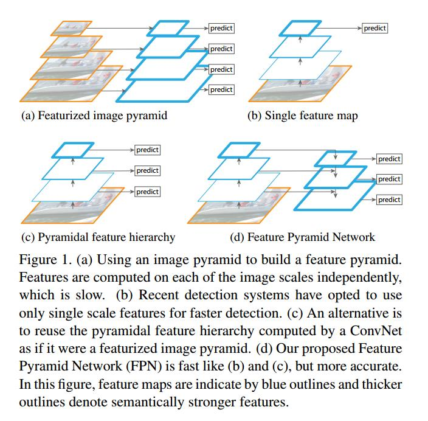

Feature Pyramid Networks for Object Detection论文阅读

# 摘要

特征金字塔**Feature pyramids**是用于检测不同尺度的对象的识别系统中的基本组件。 但是最近的深度学习对象检测器已经避免了金字塔表示，部分原因是它们是计算和内存密集型**compute and memory intensive**的。 在本文中，我们利用深层卷积网络固有的多尺度金字塔层次结构来构造具有边际额外成本**marginal extra cost**的特征金字塔。 开发了具有横向连接的自上而下架构，用于在所有尺度上构建高级语义特征图。 这种称为特征金字塔网络**Feature Pyramid Network**（FPN）的体系结构在几个应用程序中作为通用特征提取器显示出显着的改进。

# 介绍
Recognizing objects at vastly different scales is a fundamental challenge in computer vision. 

The principle advantage of featurizing each level of an image pyramid is that it produces a multi-scale feature representation in which all levels are semantically strong, including the high-resolution levels.
对图像金字塔的每个级别进行特征化的主要优点是它产生了多尺度特征表示，其中所有级别在语义上都很强，包括高分辨率级别。

featurizing each level有局限性：推理时间**Inference time**大幅增加，不具有实用价值，此外，在图像金字塔上端到端地训练深度网络在内存方面是不可行的，因此，如果被利用，图像金字塔仅在测试时使用，这会产生训练/测试时间推断不一致。Fast/Faster RCNN默认不开启。

图像金字塔不是计算多尺度特征表示的唯一方法。深层ConvNet逐层计算特征层次结构，对于子采样层，特征层次结构具有固有的多尺度，金字塔形状。这种网内特征层次结构产生不同空间分辨率的特征图，但引入了由不同深度引起的大的语义间隙。 高分辨率地图具有低级别的特征，这些特征会损害其对象识别的表征能力。

